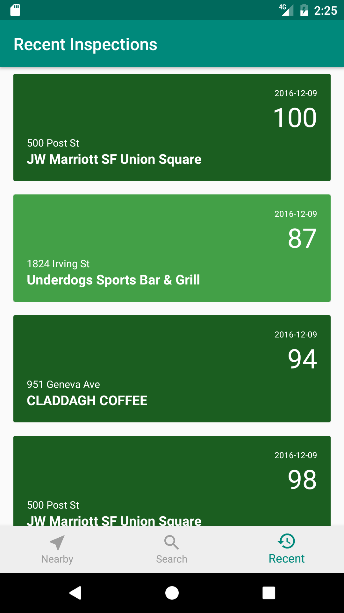

# SFHealthScores
SFHealthScores is an Android application that informs customers about restaurant inspection scores and violations in San Francisco. Users can find facilities by proximity, search, or recent inspections. Data is collected by the San Francisco Department of Public Health.

## Requirements
* Android device (Jelly Bean 4.1 and up)
* Internet connection
* Location services (for Nearby facilities)

## Screenshots

## Resources
* [Android Developer Documentation](https://developer.android.com/index.html)
* [Retrofit2](https://square.github.io/retrofit/)
* [Gson](https://github.com/google/gson)
* [Floating Search View](https://github.com/arimorty/floatingsearchview)
* [SF OpenData](https://data.sfgov.org/)
